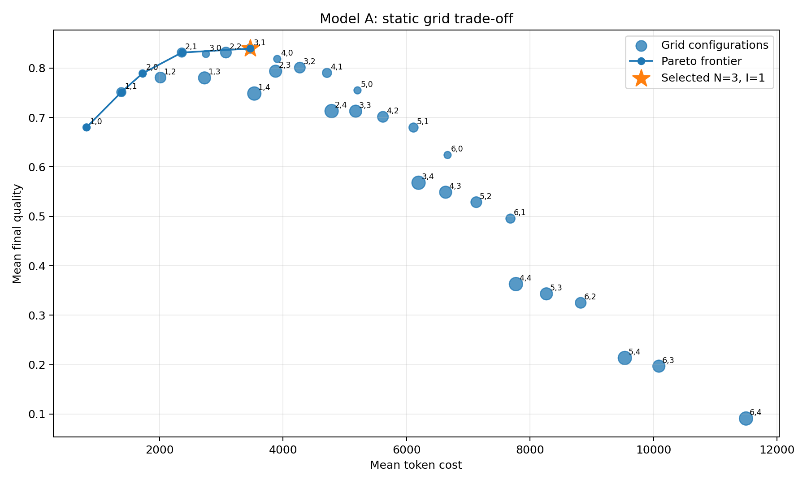
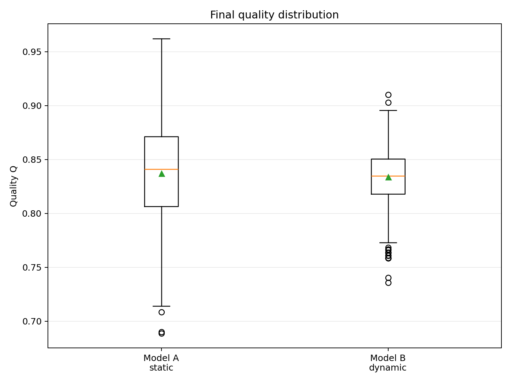
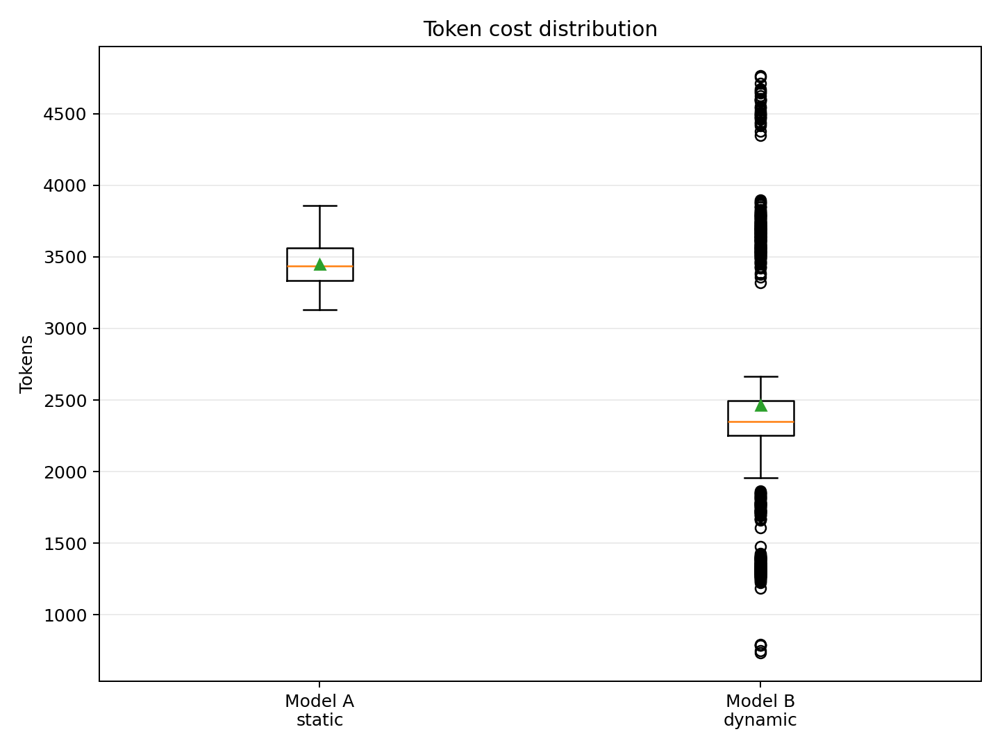
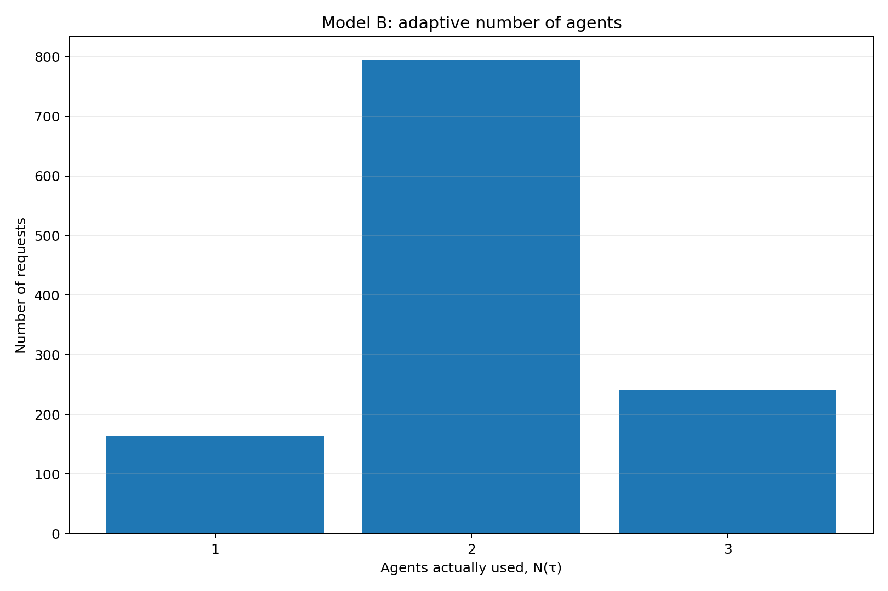

# Оптимизация многоагентных LLM-систем

В репозитории представлен воспроизводимый вычислительный эксперимент для сравнения двух способов организации многоагентной LLM-системы:

- **статической модели**, в которой для всех запросов используется фиксированная конфигурация с одинаковым числом агентов и итераций рефлексии;
- **динамической модели**, в которой маршрут обработки, число агентов и момент остановки определяются отдельно для каждого запроса с учетом его сложности, текущего качества и остатка токенного бюджета.

Исходный код эксперимента находится в файле [`multiagent_llm_optimization_simulation.py`](./multiagent_llm_optimization_simulation.py). Развернутый анализ результатов приведен в [`analytical_report.md`](./analytical_report.md). Все сформированные графики, таблицы и детализированные результаты размещены в каталоге [`multiagent_simulation_outputs`](./multiagent_simulation_outputs/).

## Структура репозитория

| Файл или каталог | Назначение |
|---|---|
| [`README.md`](./README.md) | Описание задачи, математическая постановка, навигация по файлам и краткие результаты |
| [`multiagent_llm_optimization_simulation.py`](./multiagent_llm_optimization_simulation.py) | Запускаемый Python-скрипт симуляции, Grid Search, динамической маршрутизации и Early Stopping |
| [`analytical_report.md`](./analytical_report.md) | Полный аналитический отчет с постановкой задачи, параметрами, таблицами и интерпретацией результатов |
| [`multiagent_simulation_outputs/`](./multiagent_simulation_outputs/) | Каталог с CSV-таблицами, трассировками запросов, параметрами эксперимента и визуализациями |

## Основные результаты

Статическая оптимизация выбрала конфигурацию **`N = 3`**, **`I = 1`**. Динамическая политика обеспечила сопоставимое итоговое качество при меньшем среднем расходе токенов.

| Метрика | Модель A — статическая | Модель B — динамическая |
|---|---:|---:|
| Среднее качество | 0.8371 | 0.8336 |
| Медиана качества | 0.8411 | 0.8346 |
| 10-й процентиль качества | 0.7730 | 0.8029 |
| Success rate | 1.0000 | 1.0000 |
| Средний расход токенов | 3452.23 | 2468.44 |
| 95-й процентиль расхода токенов | 3716.12 | 3790.72 |
| Среднее число агентов | 3.0000 | 2.0650 |
| Среднее число итераций рефлексии | 1.0000 | 0.9683 |

При заданной конфигурации динамическая политика:

- снизила средний расход токенов на **28.50%**;
- сохранила success rate на уровне **1.0000**;
- уменьшила среднее число задействованных агентов с **3.0000** до **2.0650**;
- повысила 10-й процентиль качества с **0.7730** до **0.8029**;
- снизила среднее качество только на **0.0034**.

> [!NOTE]
> Результаты получены в синтетической среде. Для применения модели в production необходимо откалибровать функции качества, стоимости, сложности запросов и ошибки верификатора по реальным трассировкам.

## Файлы с результатами

### Аналитический отчет

- [Отчет, сформированный скриптом](./multiagent_simulation_outputs/analytical_report.md)

### Сводные таблицы

| Файл | Содержание |
|---|---|
| [`comparison_summary.csv`](./multiagent_simulation_outputs/comparison_summary.csv) | Итоговое сравнение статической и динамической моделей по качеству, стоимости, числу агентов и итераций |
| [`comparison_by_complexity.csv`](./multiagent_simulation_outputs/comparison_by_complexity.csv) | Метрики отдельно для простых, средних и сложных запросов |
| [`simulation_parameters.csv`](./multiagent_simulation_outputs/simulation_parameters.csv) | Полный набор параметров, использованных при запуске симуляции |
| [`static_grid_train.csv`](./multiagent_simulation_outputs/static_grid_train.csv) | Результаты Grid Search по конфигурациям `N` и `I` на обучающей выборке |

### Детализированные результаты по запросам

| Файл | Содержание |
|---|---|
| [`static_test_results.csv`](./multiagent_simulation_outputs/static_test_results.csv) | Результаты статической модели для каждого запроса тестовой выборки |
| [`dynamic_test_results.csv`](./multiagent_simulation_outputs/dynamic_test_results.csv) | Результаты динамической политики, включая фактическое число агентов, итераций и причину остановки |

## Визуализации

### Компромисс между стоимостью и качеством для статической модели

[Открыть изображение в полном размере](./multiagent_simulation_outputs/01_static_tradeoff.png)

[](./multiagent_simulation_outputs/01_static_tradeoff.png)

### Сравнение распределений итогового качества

[Открыть изображение в полном размере](./multiagent_simulation_outputs/02_quality_boxplot.png)

[](./multiagent_simulation_outputs/02_quality_boxplot.png)

### Сравнение распределений токенных затрат

[Открыть изображение в полном размере](./multiagent_simulation_outputs/03_cost_boxplot.png)

[](./multiagent_simulation_outputs/03_cost_boxplot.png)

### Адаптивное число агентов динамической модели

[Открыть изображение в полном размере](./multiagent_simulation_outputs/04_dynamic_agents_histogram.png)

[](./multiagent_simulation_outputs/04_dynamic_agents_histogram.png)

## Полный состав каталога результатов

```text
multiagent_simulation_outputs/
├── 01_static_tradeoff.png
├── 02_quality_boxplot.png
├── 03_cost_boxplot.png
├── 04_dynamic_agents_histogram.png
├── analytical_report.md
├── comparison_by_complexity.csv
├── comparison_summary.csv
├── dynamic_test_results.csv
├── simulation_parameters.csv
├── static_grid_train.csv
└── static_test_results.csv
```

---

## Теоретическая постановка

Основываясь на глубоком анализе современных тенденций (2024–2026 гг.), парадигма оптимизации многоагентных систем радикально меняется. Мы уходим от поиска статических констант (количество агентов $`N`$ и итераций $`I`$) к **поиску оптимальной динамической политики маршрутизации и остановки в графе вычислений (Agentic Computation Graph).**

---

### ЧАСТЬ 1. Общая математическая постановка задачи

**1. Основные абстракции:**

процесс обработки запроса $`x`$ больше не является фиксированной цепочкой. Это динамическая траектория исполнения $`\tau`$:

```math
\tau = \left( s_0, a_0, s_1, a_1, \dots, s_K \right),
```

где:
*   $`s_t`$ — **состояние среды (Runtime-state)**: включает накопленный контекст, промежуточные результаты, сигналы верификатора, оценку сложности $`z(x)`$ и *остаток бюджета* (токены/время).
*   $`a_t`$ — **действие политики (Action)**: выбор следующего узла (агента), обращение к инструменту, сжатие контекста (summarize) или команда **STOP**.
*   $`\pi(a_t \mid s_t)`$ — **политика оркестрации (Policy)**: алгоритм, принимающий решение на каждом шаге. Переменные $`N`$ (итоговое число агентов) и $`I`$ (число циклов) теперь являются не входными параметрами, а *производными характеристиками конкретной траектории* $`\tau`$.

**2. Функция стоимости (Cost Vector):**

стоимость больше не является скалярной. Это вектор затрат:

```math
C(\tau) = \left( C_{\text{tok}}(\tau), C_{\text{\$}}(\tau), L(\tau), C_{\text{tool}}(\tau) \right),
```

где $`L(\tau)`$ — сквозная задержка (latency), $`C_{\text{tok}}`$ — токены, $`C_{\text{\$}}`$ — стоимость в деньгах.

**3. Композитная функция качества (Quality Function):**

вводим робастную композицию из трех автоматических сигналов:

```math
Q(\tau) = \alpha \cdot S_{\text{exec}} + \beta \cdot F_{\text{ground}} + \gamma \cdot J_{\text{rel}}
```

*(при $`\alpha + \beta + \gamma = 1`$)*
*   $`S_{\text{exec}} \in \{0,1\}`$ — сигнал от жесткого внешнего верификатора (Unit-тесты, SQL-чекер, валидатор схемы).
*   $`F_{\text{ground}} \in [0,1]`$ — фактологическая точность (Grounded Precision) — доля атомарных утверждений, подтвержденных исходным контекстом (подход типа FACTSCORE/RAGAS).
*   $`J_{\text{rel}}`$ — оценка судьи с поправкой на надежность (bias-aware judge utility), вычисляемая через попарное сравнение (pairwise winrate) со штрафом за позиционное смещение ($`b_{\text{position}}`$) и нестабильность ($`\omega`$ Макдональдса).

**4. Формулировка задачи оптимизации (Constrained MDP):**

найти такую политику $`\pi^*`$, которая максимизирует ожидаемое качество $`\mathbb{E} \left[ Q(\tau) \right]`$, соблюдая жесткие бюджетные ограничения и контролируя хвостовые риски (SLA):

```math
\max_{\pi} \mathbb{E}_{\tau \sim \pi} \left[ Q(\tau) \right]
```

**При условиях:**
1. $`\mathbb{E} \left[ C_{\text{\$}}(\tau) \right] \le B_{\text{max}}`$ (лимит бюджета).
2. $`\mathbb{E} \left[ L(\tau) \right] \le L_{\text{max}}`$ (лимит времени).
3. $`\Pr \left( Q(\tau) < Q_{\min} \mid z(x) \right) \le \alpha_{\text{risk}}`$ (ограничение на долю критических провалов в зависимости от класса сложности задачи $`z(x)`$).

**Критерий динамической остановки (Early Stopping Rule):**
Цикл рефлексии или маршрутизации прерывается (действие STOP), если ожидаемая предельная полезность падает ниже порога $`\lambda`$:

```math
\frac{\widehat{\Delta Q}_{t+1}}{\widehat{\Delta C}_{t+1}} < \lambda \quad \text{или} \quad \Pr \left( \Delta Q_{t+1} > \varepsilon \mid s_t \right) < \delta
```

---

### ЧАСТЬ 2. Необходимые данные и архитектура решения

Для обучения такой политики необходимо собирать детализированные графовые логи (traces) в production- или benchmark-среде. Каждая запись должна содержать:
1.  **State features.** Оценка сложности $`z(x)`$, размер текущего контекста, остаток бюджета, история предыдущих падений (failed attempts).
2.  **Transitions.** Кто кого вызвал, был ли fan-out (параллельный вызов), произошло ли сжатие памяти (compression).
3.  **Signals.** Логи внешнего верификатора на каждом шаге (успех/провал).
4.  **Marginal metrics.** Дельта токенов и дельта качества ($`\Delta Q`$) после каждой итерации, чтобы отлавливать моменты "деградации" (overthinking).

**Архитектура поиска оптимума (Как это решать):**
1.  **Уровень 1 (Routing).** Обучение легковесного классификатора $`z(x)`$, который на входе решает: пустить запрос по дешевому пути (1 агент) или включить полный многоагентный граф.
2.  **Уровень 2 (Static Scaffold).** Использование Байесовской оптимизации (как в DSPy) для подбора статических параметров: лучших промптов, few-shot примеров и температур для каждого семейства задач.
3.  **Уровень 3 (Online Policy).** Использование эвристик (Verifier-driven stopping), конформного предсказания или Offline RL для принятия решений об остановке внутри цикла на основе формулы маржинальной полезности.
