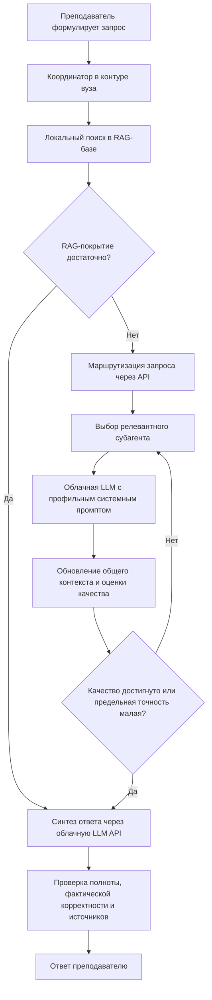

# sim_01 — токен-оптимальная маршрутизация запросов преподавателя

Каталог содержит отдельную симуляцию многоагентной системы, в которой преподаватель обращается к координатору, локальная RAG-база используется как первый источник, а специализированные субагенты при необходимости вызывают облачную LLM через API.

Основная задача — **минимизировать суммарное число облачных input- и output-токенов**, сохраняя требуемую точность и полноту ответа преподавателю.

## Состав каталога

| Файл или каталог | Назначение |
|---|---|
| [`simulate_edu_agent_routing.py`](./simulate_edu_agent_routing.py) | Полная воспроизводимая реализация симуляции на Python |
| [`model_description.md`](./model_description.md) | Математическая постановка, определение точного ответа и варианты решения |
| [`data_requirements.md`](./data_requirements.md) | Какие данные нужны для корректировки и за какой период их собирать |
| [`requirements.txt`](./requirements.txt) | Зависимости Python |
| [`outputs/simulation_report.md`](./outputs/simulation_report.md) | Автоматически сформированный отчет по результатам запуска |
| [`outputs/comparison_by_context.csv`](./outputs/comparison_by_context.csv) | Сравнение моделей для разных контекстных окон |
| [`outputs/per_query_results.csv`](./outputs/per_query_results.csv) | Детализированные результаты по каждому запросу |
| [`outputs/agent_usage.csv`](./outputs/agent_usage.csv) | Использование субагентов по сложности запросов |
| [`outputs/simulation_parameters.csv`](./outputs/simulation_parameters.csv) | Параметры текущего эксперимента |

## Архитектура процесса



Субагенты не являются отдельными локальными LLM. Каждый субагент — это профиль, системный промпт и набор правил работы с одной или несколькими облачными моделями через API. В симуляции используются шесть специализаций: нормативная база, педагогика, оценивание, цифровые инструменты, проектирование курса и администрирование.

## Общая математическая постановка задачи

Пусть преподаватель формирует запрос $`x \in \mathcal{X}`$, а координатор располагает множеством профильных субагентов
$`\mathcal{A}=\{1,\ldots,M\}`$. Для каждого запроса координатор строит не фиксированную цепочку, а траекторию обработки

```math
\tau=(s_0,a_0,s_1,a_1,\ldots,s_K),
```

где состояние $`s_t`$ включает исходный запрос, найденные RAG-фрагменты, уже полученные экспертные ответы, оценку сложности, накопленный расход токенов и остаток контекстного окна. Действие выбирается из множества

```math
a_t \in \{\mathrm{RAG},\mathrm{CALL}(j),\mathrm{SYNTHESIZE},\mathrm{STOP}\},
\qquad j\in\mathcal{A}.
```

Политика оркестрации $`\pi(a_t\mid s_t)`$ определяет, какого субагента вызвать следующим, требуется ли дополнительный поиск и когда завершить обработку.

### Целевая функция

Главная величина оптимизации — суммарное число токенов, переданных облачным моделям и полученных от них:

```math
T_{\mathrm{cloud}}(\tau)=
\sum_{t\in\mathcal{C}(\tau)}
\left(T^{\mathrm{in}}_t+T^{\mathrm{out}}_t\right),
```

где $`\mathcal{C}(\tau)`$ — множество облачных API-вызовов координатора, субагентов и финального синтеза. Если требуется оптимизировать стоимость, используется

```math
C_{\mathrm{API}}(\tau)=
\sum_{t\in\mathcal{C}(\tau)}
\frac{p^{\mathrm{in}}_tT^{\mathrm{in}}_t+p^{\mathrm{out}}_tT^{\mathrm{out}}_t}{10^6},
```

где $`p^{\mathrm{in}}_t`$ и $`p^{\mathrm{out}}_t`$ — тарифы за миллион входных и выходных токенов. Такая сумма соответствует правилам учета API-токенов, приведенным в документации DeepSeek [1].

### Ограничение контекстного окна

Контекстное окно $`W`$ является параметром задачи. Для каждого облачного вызова и особенно для финального синтеза должно выполняться

```math
T_{\mathrm{sys}}+T_x+T_{\mathrm{RAG}}+
\sum_{j\in A(\tau)}T^{\mathrm{summary}}_j+
T^{\mathrm{out,max}} \le W,
```

где $`A(\tau)\subseteq\mathcal{A}`$ — фактически выбранные субагенты. Поэтому увеличение числа агентов не только повышает стоимость, но и конкурирует за место в контексте: часть доказательств может быть усечена или вытеснена нерелевантными фрагментами.

### Вектор качества и определение точного ответа

В общем виде качество ответа не следует сводить только к одной величине. Для ответа $`y`$ вводится вектор

```math
\mathbf{q}(y,x)=
\left(C_{\mathrm{req}},F,G,A_{\mathrm{fit}}\right),
```

где $`C_{\mathrm{req}}`$ — покрытие требований преподавателя, $`F`$ — фактическая корректность, $`G`$ — подтвержденность источниками, а $`A_{\mathrm{fit}}`$ — педагогическая применимость и соответствие формату задания. Компоненты фактической корректности, релевантности и подтвержденности контекстом согласуются с многомерной оценкой RAG-систем в RAGAS и ARES [6, 7]; покрытие требований и педагогическая применимость добавлены как предметно-ориентированные критерии имитационного сценария.

В основной постановке ответ считается точным не по среднему баллу, а при выполнении набора обязательных ограничений:

```math
E_{\mathrm{exact}}(y,x)=1
\iff
\begin{cases}
C_{\mathrm{req}}\ge c_{\min},\\
F\ge f_{\min},\\
G\ge g_{\min},\\
A_{\mathrm{fit}}\ge a_{\min}.
\end{cases}
```

Такое определение не позволяет высокой оценке по одному показателю компенсировать критический провал по другому, например фактическую ошибку или отсутствие обязательного нормативного источника.

### Общая оптимизационная задача

Требуется найти политику маршрутизации и остановки, минимизирующую ожидаемый расход облачных токенов:

```math
\pi^*=\arg\min_{\pi}
\mathbb{E}_{x\sim P_X,\,\tau\sim\pi}
\left[T_{\mathrm{cloud}}(\tau)\right],
```

при ограничениях

```math
\Pr_{\tau\sim\pi}
\left(E_{\mathrm{exact}}(y_\tau,x)=1\mid z(x)=c\right)
\ge 1-\alpha_c,
\qquad \forall c\in\{\text{простые, средние, сложные}\},
```

```math
T_{\mathrm{context}}(a_t)\le W,
\qquad
T_{\mathrm{cloud}}(\tau)\le B_{\max},
\qquad
K(\tau)\le K_{\max}.
```

Здесь $`z(x)`$ — класс сложности запроса, $`\alpha_c`$ — допустимая вероятность неточного ответа для соответствующего класса, $`B_{\max}`$ — предельный токенный бюджет, а $`K_{\max}`$ — максимально допустимое число облачных вызовов. Это задача ограниченной последовательной оптимизации: статическая и динамическая схемы ниже являются двумя частными классами допустимых политик.

Для динамической модели следующий субагент вызывается только тогда, когда прогнозируемый прирост качества оправдывает дополнительные токены:

```math
\frac{\widehat{\Delta Q}_{t+1}}
{\widehat{\Delta T}_{t+1}/1000}\ge\lambda.
```

Идея поиска политики, которая сохраняет качество при меньших затратах, соответствует постановкам каскадного и cost-aware routing в FrugalGPT и RouteLLM [3, 4].

## Сравниваемые модели

### `STATIC_ALL`

Если локальная RAG-база не дает достаточно уверенного ответа, координатор вызывает все шесть субагентов. Подход прост и обеспечивает высокое покрытие, но повторно передает запрос и фрагменты контекста в облако, поэтому расход токенов велик.

### `DYNAMIC_ACG`

После RAG координатор оценивает домены запроса и последовательно вызывает только наиболее полезных субагентов. Новый вызов выполняется, если ожидаемый прирост качества на 1000 токенов превышает порог. Опрос прекращается при достижении требуемого качества, исчерпании контекстного бюджета или снижении маржинальной полезности.

## Что считается точным ответом преподавателю в текущей симуляции

Общая постановка выше использует вектор обязательных критериев. Для ранжирования промежуточных состояний и построения графиков в симуляции дополнительно применяется скалярный служебный показатель:

```math
Q_{w}=w_C C_{\mathrm{req}}+w_FF+w_GG+w_AA_{\mathrm{fit}},
\qquad
w_C+w_F+w_G+w_A=1,
\qquad w_j\ge0.
```

Коэффициенты $`w_j`$ не являются универсальными константами и не заимствованы из RAGAS, ARES или другого опубликованного набора. В текущем синтетическом эксперименте использована исходная экспертная настройка

```math
(w_C,w_F,w_G,w_A)=(0.35,0.30,0.20,0.15),
```

которая задает следующий приоритет: сначала покрытие требований преподавателя, затем фактическая корректность, подтвержденность источниками и педагогическая применимость. Эти веса нужны только для воспроизводимого частного расчета и сравнения стратегий; они не доказывают, что такое соотношение оптимально для вуза.

В программной реализации ответ помечается как точный при одновременном выполнении условий:

```math
Q_w \ge 0.82, \qquad
F \ge 0.84, \qquad
C_{\mathrm{req}} \ge 0.78, \qquad
A_{\mathrm{answer\_fit}} \ge 0.92.
```

Показатель $`G`$ влияет на итоговый $`Q_w`$, но в текущем коде не имеет отдельного жесткого порога. Для нормативных запросов в рабочей системе рекомендуется добавить условие $`G\ge g_{\min}`$ и проверку актуальности источника.

Для корректировки весов на реальных данных необходимо собрать ответы, которые оценили преподавателями по четырем компонентам, и бинарное решение $`r_n\in\{0,1\}`$ «ответ принят / требуется доработка». Затем параметры можно оценить, например, логистической моделью

```math
\Pr(r_n=1\mid\mathbf{q}_n)=
\sigma\!\left(\beta_0+\beta_C C_{\mathrm{req},n}+\beta_FF_n+\beta_GG_n+\beta_AA_{\mathrm{fit},n}\right),
```

после чего положительные коэффициенты нормируются:

```math
w_j=\frac{\max(\beta_j,0)}{\sum_k\max(\beta_k,0)}.
```

Порог точности выбирается на отдельной валидационной выборке так, чтобы обеспечить требуемую долю принятых ответов и ограничить число критических ошибок. Тем самым опубликованные подходы RAGAS и ARES задают состав измеряемых сигналов [6, 7], а конкретные веса определяются данными и требованиями вуза, а не назначаются как неизменные нормативные значения.

## Контекстные окна образовательного сценария

В эксперименте сравниваются четыре **вычислительных лимита** контекста координатора:

| Окно | Интерпретация образовательного сценария |
|---:|---|
| 4 096 | Краткая консультация, один предметный аспект, небольшой RAG-фрагмент |
| 8 192 | Типовой методический или нормативный вопрос с несколькими источниками |
| 16 384 | Междисциплинарная задача, проектирование занятия или системы оценивания |
| 32 768 | Комплексная нормативно-методическая задача с несколькими экспертными ответами |

Эти значения являются управляемыми сценариями эксперимента, а не техническими пределами облачной модели. Они задают, сколько токенов координатор разрешает включить в пакет финального синтеза. Современный API может поддерживать существенно большее окно, но передача всего доступного контекста не является оптимальной по стоимости и может включать нерелевантные данные.

## Результаты симуляции

Смоделировано 1800 тестовых запросов: простых, средних и сложных. Локальный RAG применяется в обеих моделях, а облачные токены учитывают routing, обращения субагентов и финальный синтез.

| Контекст | Модель | Среднее `$`Q`$` | Доля точных ответов | Среднее число облачных токенов | Среднее число агентов |
|---:|---|---:|---:|---:|---:|
| 4 096 | `STATIC_ALL` | 0.8699 | 0.7372 | 16 753.8 | 5.36 |
| 4 096 | `DYNAMIC_ACG` | 0.8763 | 0.6994 | 10 818.6 | 1.87 |
| 8 192 | `STATIC_ALL` | 0.9462 | 0.9967 | 19 527.1 | 5.36 |
| 8 192 | `DYNAMIC_ACG` | 0.9331 | 0.9967 | 12 377.7 | 1.87 |
| 16 384 | `STATIC_ALL` | 0.9579 | 0.9967 | 20 068.7 | 5.36 |
| 16 384 | `DYNAMIC_ACG` | 0.9353 | 0.9967 | 12 449.0 | 1.87 |
| 32 768 | `STATIC_ALL` | 0.9582 | 0.9967 | 20 068.7 | 5.36 |
| 32 768 | `DYNAMIC_ACG` | 0.9354 | 0.9967 | 12 449.0 | 1.87 |

### Основной вывод

Окно **8 192 токена** в текущем сценарии является минимальным из исследованных вариантов, при котором динамическая модель достигает той же доли точных ответов, что и статическая модель — `0.9967`, — но использует в среднем на **36.6% меньше облачных токенов**. Переход к 16 384 токенам слегка повышает среднее качество динамической модели, но практически не меняет долю точных ответов; это проявление убывающей отдачи.

Окно 4 096 токенов недостаточно для части сложных междисциплинарных запросов: даже при высоком среднем `$`Q`$` итоговый ответ иногда не помещается полностью или теряет часть обязательных требований. Поэтому его целесообразно применять только для коротких запросов после надежной классификации сложности.

## Графики

### Расход облачных токенов

[](./outputs/01_tokens_by_context.png)

**Результат.** Динамическая маршрутизация снижает токенный расход во всех сценариях окна, поскольку большинство запросов не требует обращения ко всему пулу экспертов.

### Качество ответа

[](./outputs/02_quality_by_context.png)

**Результат.** Для окна 8 192 токена обе модели превышают целевой уровень качества. Дальнейшее расширение окна дает небольшой прирост, особенно для динамической модели.

### Число субагентов по сложности запроса

[](./outputs/03_agents_by_context.png)

**Результат.** Динамическая модель использует примерно 1.10 агента для простых запросов, 2.29 — для средних и 2.81 — для сложных, вместо фиксированного опроса всех экспертов.

### Индивидуальный компромисс «качество–токены»

[](./outputs/04_quality_cost_scatter.png)

**Результат.** Основная масса динамических траекторий находится левее статических, то есть достигает сопоставимого качества при меньшем числе облачных токенов.

### Доли маршрутов

[](./outputs/05_route_distribution.png)

**Результат.** Часть запросов завершается после RAG, остальные переходят к специализированным субагентам. В production доля RAG-only должна использоваться как отдельный показатель качества локальной базы знаний.

## Запуск

```bash
cd sim_01
pip install -r requirements.txt
python simulate_edu_agent_routing.py
```

Все изменяемые параметры находятся в блоке:

```python
### [CHANGE HERE: PARAMETERS TO PLAY WITH] ###
```

После запуска каталог `outputs` обновляется автоматически.

## Практический выбор политики

Для первого пилота рекомендуется:

1. использовать окно 8 192 токена как базовое;
2. разрешать 4 096 токенов только для запросов, классифицированных как простые;
3. повышать окно до 16 384 для сложных нормативно-методических запросов;
4. не вызывать всех агентов заранее — выбирать их последовательно по ожидаемому вкладу;
5. перед выдачей ответа проверять обязательные требования, факты и источники;
6. собирать реальные трассы не менее двух учебных семестров и затем переоценить пороги routing и Early Stopping.

## Связь с близкими подходами

Предлагаемая схема сочетает идеи каскадного выбора моделей, cost-aware routing и адаптивного RAG. FrugalGPT рассматривает каскады API-моделей для снижения стоимости, RouteLLM обучает маршрутизатор на данных предпочтений, а MBA-RAG применяет bandit-подход для выбора стратегии извлечения в зависимости от сложности вопроса. В `sim_01` эти идеи перенесены с выбора модели на выбор профильных субагентов и момента остановки.

## Источники

1. DeepSeek API Docs. Models & Pricing: <https://api-docs.deepseek.com/quick_start/pricing>
2. DeepSeek API Docs. JSON Output: <https://api-docs.deepseek.com/guides/json_mode>
3. Chen L., Zaharia M., Zou J. FrugalGPT: How to Use Large Language Models While Reducing Cost and Improving Performance. <https://arxiv.org/abs/2305.05176>
4. Ong I. et al. RouteLLM: Learning to Route LLMs with Preference Data. <https://arxiv.org/abs/2406.18665>
5. Tang X. et al. MBA-RAG: A Bandit Approach for Adaptive Retrieval-Augmented Generation through Question Complexity. <https://arxiv.org/abs/2412.01572>
6. Es S., James J., Espinosa-Anke L., Schockaert S. RAGAS: Automated Evaluation of Retrieval Augmented Generation. DOI: <https://doi.org/10.48550/arXiv.2309.15217>
7. Saad-Falcon J., Khattab O., Potts C., Zaharia M. ARES: An Automated Evaluation Framework for Retrieval-Augmented Generation Systems. DOI: <https://doi.org/10.48550/arXiv.2311.09476>

**Основание расчета.** Суммарное потребление облачных токенов рассчитывается как сумма входных и выходных токенов всех API-вызовов согласно правилам тарификации DeepSeek [1]. Структура показателей качества основана на многомерной оценке RAG-систем в RAGAS и ARES [6, 7]. Коэффициенты `0.35`, `0.30`, `0.20`, `0.15` являются параметрами данного синтетического сценария и должны быть заменены коэффициентами, откалиброванными по экспертным оценкам преподавателей.
