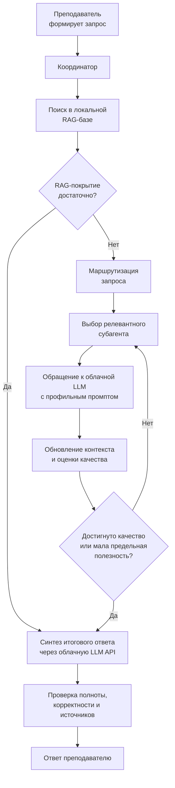
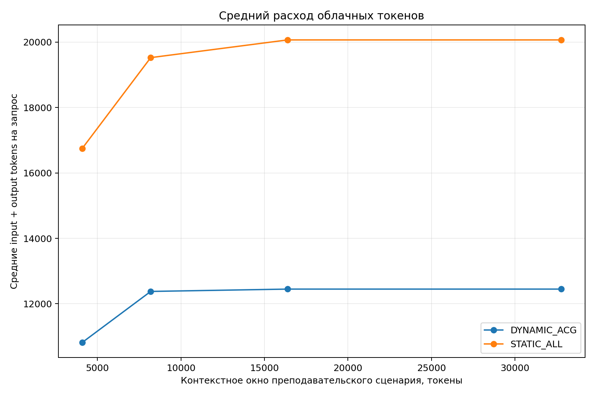
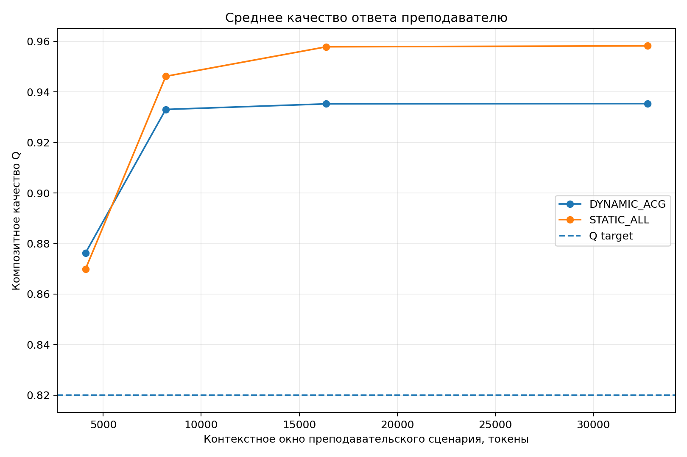
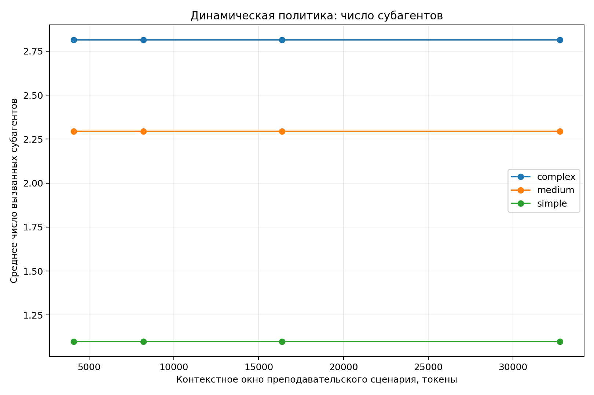
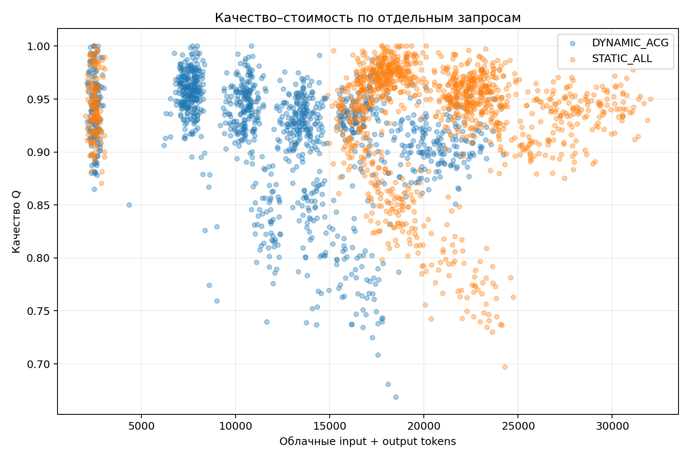
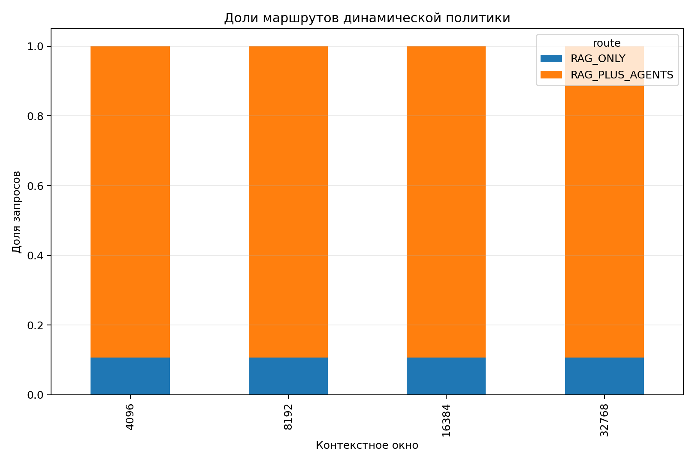

# sim_01 — токен-оптимальная маршрутизация запросов преподавателя

Каталог содержит отдельную симуляцию вузовской многоагентной системы, в которой преподаватель обращается к координатору, локальная RAG-база используется как первый источник, а специализированные субагенты при необходимости вызывают облачную LLM через API.

Основная задача — **минимизировать суммарное число облачных input- и output-токенов**, сохраняя требуемую точность и полноту ответа преподавателю.

## Состав каталога

| Файл или каталог | Назначение |
|---|---|
| [`simulate_edu_agent_routing.py`](./simulate_edu_agent_routing.py) | Полная воспроизводимая реализация симуляции на Python |
| [`model_description.md`](./model_description.md) | Математическая постановка, определение точного ответа и варианты решения |
| [`data_requirements.md`](./data_requirements.md) | Какие реальные данные нужны для калибровки и за какой период их собирать |
| [`requirements.txt`](./requirements.txt) | Зависимости Python |
| [`outputs/simulation_report.md`](./outputs/simulation_report.md) | Автоматически сформированный отчет по результатам запуска |
| [`outputs/comparison_by_context.csv`](./outputs/comparison_by_context.csv) | Сравнение моделей для разных контекстных окон |
| [`outputs/per_query_results.csv`](./outputs/per_query_results.csv) | Детализированные результаты по каждому запросу |
| [`outputs/agent_usage.csv`](./outputs/agent_usage.csv) | Использование субагентов по сложности запросов |
| [`outputs/simulation_parameters.csv`](./outputs/simulation_parameters.csv) | Параметры текущего эксперимента |

## Архитектура процесса



Субагенты не являются отдельными локальными LLM. Каждый субагент — это профиль, системный промпт и набор правил работы с одной или несколькими облачными моделями через API. В симуляции используются шесть специализаций: нормативная база, педагогика, оценивание, цифровые инструменты, проектирование курса и администрирование.

## Сравниваемые модели

### `STATIC_ALL`

Если локальная RAG-база не дает достаточно уверенного ответа, координатор вызывает все шесть субагентов. Подход прост и обеспечивает высокое покрытие, но повторно передает запрос и фрагменты контекста в облако, поэтому расход токенов велик.

### `DYNAMIC_ACG`

После RAG координатор оценивает домены запроса и последовательно вызывает только наиболее полезных субагентов. Новый вызов выполняется, если ожидаемый прирост качества на 1000 токенов превышает порог. Опрос прекращается при достижении требуемого качества, исчерпании контекстного бюджета или снижении маржинальной полезности.

## Что считается точным ответом преподавателю

Композитное качество задается как:

```math
Q = 0.35C_{req} + 0.30F + 0.20G + 0.15A,
```

где:

- `$`C_{req}`$` — покрытие требований, содержащихся в запросе преподавателя;
- `$`F`$` — фактическая корректность;
- `$`G`$` — подтвержденность локальными или явно указанными источниками;
- `$`A`$` — педагогическая применимость и соответствие требуемому формату.

В текущей симуляции ответ считается точным только при одновременном выполнении условий:

```math
Q \ge 0.82, \qquad
F \ge 0.84, \qquad
C_{req} \ge 0.78, \qquad
A_{fit} \ge 0.92.
```

Для реальной системы критерии должны зависеть от типа запроса. Например, нормативный ответ должен содержать действующий источник и реквизиты документа, программный ответ — проходить тесты, а методическое решение — закрывать рубрику преподавателя и быть выполнимым в заданных условиях.

## Контекстные окна образовательного сценария

В эксперименте сравниваются четыре **операционных лимита** контекста координатора:

| Окно | Интерпретация образовательного сценария |
|---:|---|
| 4 096 | Краткая консультация, один предметный аспект, небольшой RAG-фрагмент |
| 8 192 | Типовой методический или нормативный вопрос с несколькими источниками |
| 16 384 | Междисциплинарная задача, проектирование занятия или системы оценивания |
| 32 768 | Комплексная нормативно-методическая задача с несколькими экспертными ответами |

Эти значения являются управляемыми сценариями эксперимента, а не техническими пределами облачной модели. Они задают, сколько токенов координатор разрешает включить в пакет финального синтеза. Современный API может поддерживать существенно большее окно, но передача всего доступного контекста не является оптимальной по стоимости и может включать нерелевантные данные.

## Результаты симуляции

Смоделировано 1800 тестовых запросов: простых, средних и сложных. Локальный RAG применяется в обеих моделях, а облачные токены учитывают routing, обращения субагентов и финальный синтез.

| Контекст | Модель | Среднее `$`Q`$` | Доля точных ответов | Средние облачные токены | Среднее число агентов |
|---:|---|---:|---:|---:|---:|
| 4 096 | `STATIC_ALL` | 0.8699 | 0.7372 | 16 753.8 | 5.36 |
| 4 096 | `DYNAMIC_ACG` | 0.8763 | 0.6994 | 10 818.6 | 1.87 |
| 8 192 | `STATIC_ALL` | 0.9462 | 0.9967 | 19 527.1 | 5.36 |
| 8 192 | `DYNAMIC_ACG` | 0.9331 | 0.9967 | 12 377.7 | 1.87 |
| 16 384 | `STATIC_ALL` | 0.9579 | 0.9967 | 20 068.7 | 5.36 |
| 16 384 | `DYNAMIC_ACG` | 0.9353 | 0.9967 | 12 449.0 | 1.87 |
| 32 768 | `STATIC_ALL` | 0.9582 | 0.9967 | 20 068.7 | 5.36 |
| 32 768 | `DYNAMIC_ACG` | 0.9354 | 0.9967 | 12 449.0 | 1.87 |

### Основной вывод

Окно **8 192 токена** в текущем сценарии является минимальным из исследованных вариантов, при котором динамическая модель достигает той же доли точных ответов, что и статическая модель — `0.9967`, — но использует в среднем на **36.6% меньше облачных токенов**. Переход к 16 384 токенам слегка повышает среднее качество динамической модели, но практически не меняет долю точных ответов; это проявление убывающей отдачи.

Окно 4 096 токенов недостаточно для части сложных междисциплинарных запросов: даже при высоком среднем `$`Q`$` итоговый ответ иногда не помещается полностью или теряет часть обязательных требований. Поэтому его целесообразно применять только для коротких запросов после надежной классификации сложности.

## Графики

### Расход облачных токенов

[](./outputs/01_tokens_by_context.png)

**Результат.** Динамическая маршрутизация снижает токенный расход во всех сценариях окна, поскольку большинство запросов не требует обращения ко всему пулу экспертов.

### Качество ответа

[](./outputs/02_quality_by_context.png)

**Результат.** Для окна 8 192 токена обе модели превышают целевой уровень качества. Дальнейшее расширение окна дает небольшой прирост, особенно для динамической модели.

### Число субагентов по сложности запроса

[](./outputs/03_agents_by_context.png)

**Результат.** Динамическая модель использует примерно 1.10 агента для простых запросов, 2.29 — для средних и 2.81 — для сложных, вместо фиксированного опроса всех экспертов.

### Индивидуальный компромисс «качество–токены»

[](./outputs/04_quality_cost_scatter.png)

**Результат.** Основная масса динамических траекторий находится левее статических, то есть достигает сопоставимого качества при меньшем числе облачных токенов.

### Доли маршрутов

[](./outputs/05_route_distribution.png)

**Результат.** Часть запросов завершается после RAG, остальные переходят к специализированным субагентам. В production доля RAG-only должна использоваться как отдельный показатель качества локальной базы знаний.

## Запуск

```bash
cd sim_01
pip install -r requirements.txt
python simulate_edu_agent_routing.py
```

Все изменяемые параметры находятся в блоке:

```python
### [CHANGE HERE: PARAMETERS TO PLAY WITH] ###
```

После запуска каталог `outputs` обновляется автоматически.

## Практический выбор политики

Для первого пилота рекомендуется:

1. использовать окно 8 192 токена как базовое;
2. разрешать 4 096 токенов только для запросов, классифицированных как простые;
3. повышать окно до 16 384 для сложных нормативно-методических запросов;
4. не вызывать всех агентов заранее — выбирать их последовательно по ожидаемому вкладу;
5. перед выдачей ответа проверять обязательные требования, факты и источники;
6. собирать реальные трассы не менее двух учебных семестров и затем переоценить пороги routing и Early Stopping.

## Связь с близкими подходами

Предлагаемая схема сочетает идеи каскадного выбора моделей, cost-aware routing и адаптивного RAG. FrugalGPT рассматривает каскады API-моделей для снижения стоимости, RouteLLM обучает маршрутизатор на данных предпочтений, а MBA-RAG применяет bandit-подход для выбора стратегии извлечения в зависимости от сложности вопроса. В `sim_01` эти идеи перенесены с выбора модели на выбор профильных субагентов и момента остановки.

## Источники

1. DeepSeek API Docs. Models & Pricing: <https://api-docs.deepseek.com/quick_start/pricing>
2. DeepSeek API Docs. JSON Output: <https://api-docs.deepseek.com/guides/json_mode>
3. Chen L., Zaharia M., Zou J. FrugalGPT: How to Use Large Language Models While Reducing Cost and Improving Performance. <https://arxiv.org/abs/2305.05176>
4. Ong I. et al. RouteLLM: Learning to Route LLMs with Preference Data. <https://arxiv.org/abs/2406.18665>
5. Tang X. et al. MBA-RAG: A Bandit Approach for Adaptive Retrieval-Augmented Generation through Question Complexity. <https://arxiv.org/abs/2412.01572>
